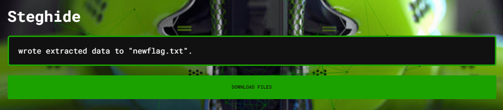
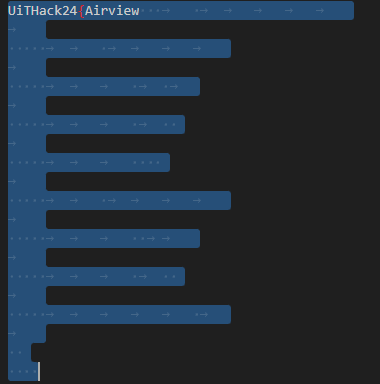
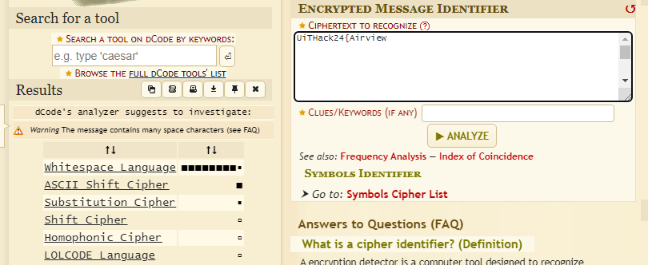
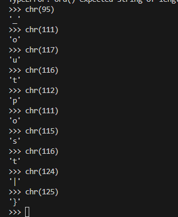

# Hidden Covenant Info 

The covenant is slowly advancing to New Mombasa. We managed to catch a photo they sent in their communications channel, however we do not have their location. We believe the covenant is communicating with photos. Your mission Rookie, is to figure out what their location is; by finding the hidden information within the photo.

[⬇️ Yanmee.jpg](./Yanmee.jpg)

# writeup

On this one I used [aperisolve.com](https://www.aperisolve.com/) which shows me there is something in steghide: [newflag.txt](./newflag.txt)



Opening that in VSCode it shows part of a flag and a whole lot of spaces and tabs it looks like, is it some code?



Pasting that into [dCode.fr](https://www.dcode.fr/cipher-identifier) I get a good hit on `Whitespace Language`



The dCode.fr decoder did not work so I googled and found [this website](https://naokikp.github.io/wsi/whitespace.html) which works and gives me this:

```
[0] SS STSTTTTTL (push 95)
[1] TLSS (prtc)
[2] SS STTSTTTTL (push 111)
[3] TLSS (prtc)
[4] SS STTTSTSTL (push 117)
[5] TLSS (prtc)
[6] SS STTTSTSSL (push 116)
[7] TLSS (prtc)
[8] SS STTTSSSSL (push 112)
[9] TLSS (prtc)
[10] SS STTSTTTTL (push 111)
[11] TLSS (prtc)
[12] SS STTTSSTTL (push 115)
[13] TLSS (prtc)
[14] SS STTTSTSSL (push 116)
[15] TLSS (prtc)
[16] SS STTTTTSTL (push 125)
[17] TLSS (prtc)
```

This seems to be ascii codes (push xxx) so I just manually decoded each and every one to get the rest of the flag.



```
UiTHack24{Airview_outpost}
```