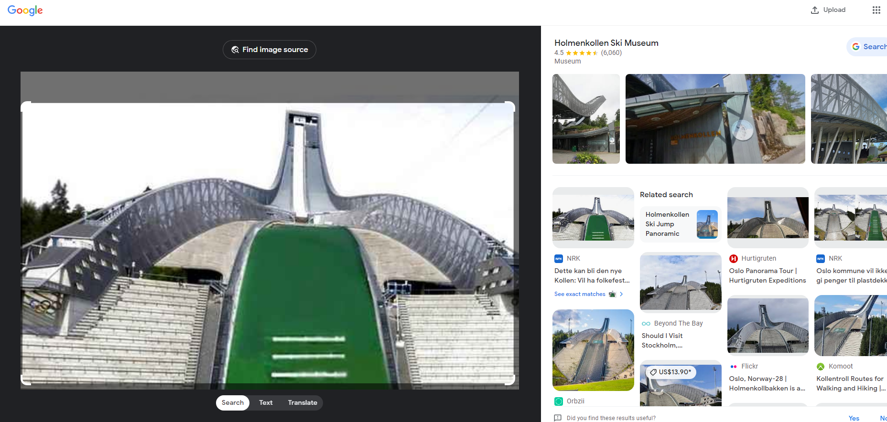
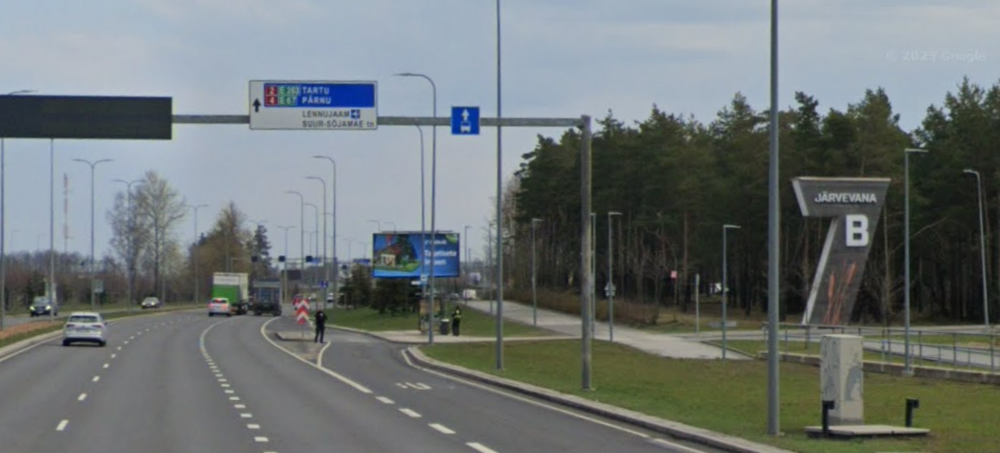
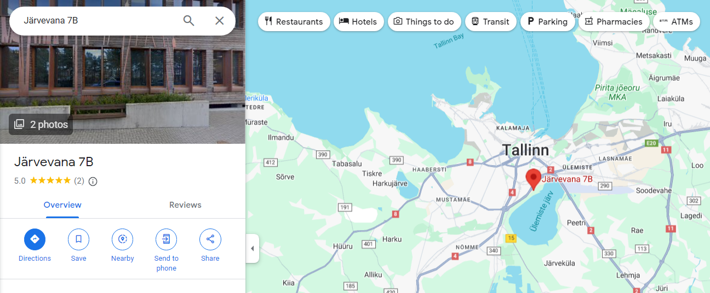
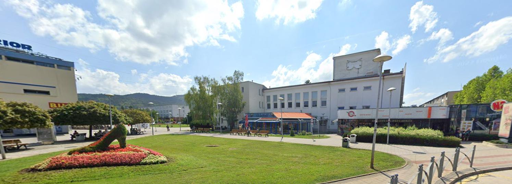
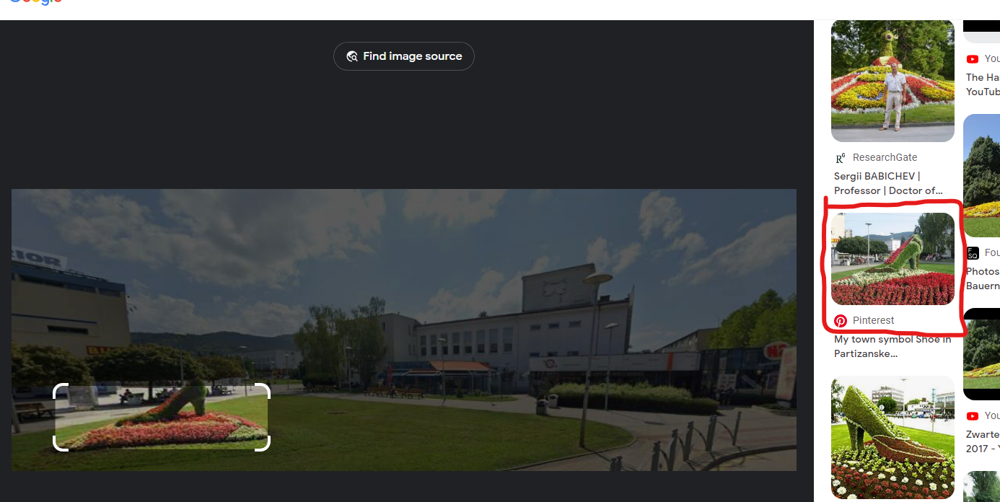
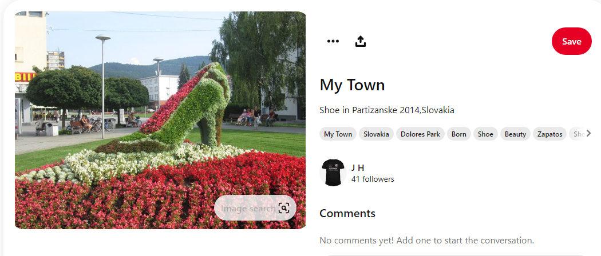

# Location

The aliens have captured three of our crew members and is holding them hostage at different locations. Luckily, they managed to send us pictures of their surroundings. Can you figure out where they are being held captive?

The flag is the cities where these picture was taken, in lowercase, wrapped in UiTHack24{}. If you encouter any acute accent characters (e.g. à) in the city name, replace them with their non-accented counterparts (e.g. a).

Example: UiTHack24{city1_city2_city3}

[⬇️ city1.png](./city1.png)
[⬇️ city2.png](./city2.png)
[⬇️ city3.png](./city3.png)

# Writeup

## City 1 (Oslo)

First image I tossed into Google Image Search and got the following results:



That is Holmekollen in `Oslo`.

## City 2 (Tallinn)



This image clearly shows a big number `7b` with an address. Google maps shows me that that is in Tallinn



## City 2 (Partizanske)



This image gave me nothing on google images but I did focus on the shoe and got a hit on pintrest with the same shoe.



Going into there the image tells which city it is in.



## Flag

```
UiTHack24{oslo_tallinn_partizanske}
```