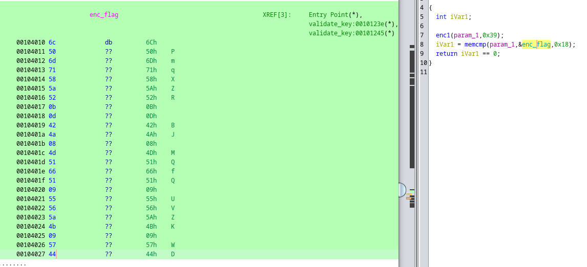

# Expired License

The subscription on the software for our spaceship has expired, and we can't get back to Earth without it. We don't want to pay for a new license. Can you find the license key?

[⬇️ expired_license](./expired_license)

# Writeup

Opening the software up in Ghidra we see this code in the main function:

```c
printf("Enter the key: ");
fgets((char *)&local_38,0x28,stdin);
iVar1 = validate_key(&local_38);
if (iVar1 == 0) {
  puts("Wrong key!");
}
else {
  puts("Correct key!");
}
```

Jumping to the `validate_key` function we see this:

```c
bool validate_key(void *param_1) {
  int iVar1;

  enc1(param_1,0x39);
  iVar1 = memcmp(param_1,enc_flag,0x18);
  return iVar1 == 0;
}
```

So the key is encrypted with `enc1` and then compared to `enc_flag`. `enc1` is defined as:

```c
void enc1(long param_1,byte param_2) {
  int local_c;

  for (local_c = 0; local_c < 0x18; local_c = local_c + 1) {
    *(byte *)(param_1 + local_c) = *(byte *)(param_1 + local_c) ^ param_2;
  }
  return;
}
```

Basic XOR encryption. We can just XOR the encrypted flag with 0x39 to get the flag.

So looking at `enc_flag` in Ghidra we see this:



```c
6c506d71585a520b0d424a084d5166510955565a4b095744
```

Using [Cyberchef](https://gchq.github.io/CyberChef/#recipe=From_Hex('Auto')XOR(%7B'option':'Hex','string':'39'%7D,'Standard',false)&input=NmM1MDZkNzE1ODVhNTIwYjBkNDI0YTA4NGQ1MTY2NTEwOTU1NTY1YTRiMDk1NzQ0) to `XOOR` the hex value with the hex value of `0x39` we get the flag:

```
UiTHack24{s1th_h0locr0n}
```