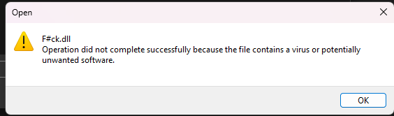

# F#ck

Prepare to embark on an adventure into the realm of functional programming. Some say that the language is so powerful that it can even be used to solve the most complex of problems. Find the flag in the following file:

[⬇️ Fck.zip](./Fck.zip)

# WRiteup

In the zip there is a `.dll` file which I learned last CTF we could use `dnSpy` to decompile. So I opened it up in `dnSpy` quickly Windows had their saying.



So had to disable the antivirus to continue. After that I opened the file in `dnSpy` and found the flag in the `Program` class.


```c#
{
    string a = ArrayModule.Head<string>(args);
    FSharpFunc<char, char> _instance = Program.flag@13.@_instance;
    char[] array = "lano!tkc@f".ToCharArray();
    string text = new string(ArrayModule.Reverse<char>(ArrayModule.OfSeq<char>(SeqModule.Map<char, char>(@_instance, SeqModule.Map<char, char>(Program.flag@12-1.@_instance, array)))));
    if (string.Equals(a, "D2005S"))
    {
        PrintfFormat<FSharpFunc<string, Unit>, TextWriter, Unit, Unit> printfFormat2 = new PrintfFormat<FSharpFunc<string, Unit>, TextWriter, Unit, Unit, string>("UiTHack24{%s}");
        PrintfModule.PrintFormatLineToTextWriter<FSharpFunc<string, Unit>>(Console.Out, printfFormat2).Invoke(text);
    }
}
```

There are some reversing and stuff going on but not quite sure what. But it seems to print the data in the array in reverse into the UiTHack24{} format. So I just copied the array and reversed it. It made a bit of sense but not 100%. I just had to try it!

```
lano!tkc@f => f@ckt!onal
```

Wrapped it and got the flag.

```
UiTHack24{f@ckt!onal}
```

Bingo! 