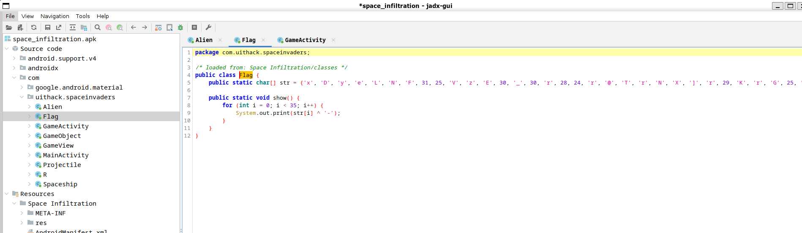

# Infiltration

You are given a covert mission to infiltrate an enigmatic alien base located within the depths of Dexius. Accomplishing this mission will demand your utmost courage and skills, as you're set to engage in a fierce space battle against aliens.

[⬇️ space_infiltration.apk](./space_infiltration.apk)

# Writeup

Had a bit of troubles here, never seen an `apk` in a CTF before. But a quick google got me to install `jadx` which came with a GUI. So I opened the apk in `jadx-gui` and found a `Flag` function pretty quickly.



```java
package com.uithack.spaceinvaders;

/* loaded from: Space Infiltration/classes */
public class Flag {
    public static char[] str = {'x', 'D', 'y', 'e', 'L', 'N', 'F', 31, 25, 'V', 'z', 'E', 30, '_', 30, 'r', 28, 24, 'r', '@', 'T', 'r', 'N', 'X', ']', 'r', 29, 'K', 'r', 'G', 25, '[', 25, 18, 'P'};

    public static void show() {
        for (int i = 0; i < 35; i++) {
            System.out.print(str[i] ^ '-');
        }
    }
}
```

Seems to be another XOR encryption. I just copied the array and XORed it with `-` to get the flag.

I made this quick [solve.js](solve.js) script to do that:

```javascript
// Define the character array from the Java code
const str = ['x', 'D', 'y', 'e', 'L', 'N', 'F', 31, 25, 'V', 'z', 'E', 30, '_', 30, 'r', 28, 24, 'r', '@', 'T', 'r', 'N', 'X', ']', 'r', 29, 'K', 'r', 'G', 25, '[', 25, 18, 'P'];

let output = '';
for (let i = 0; i < str.length; i++) {
  // If number, use directly, otherwise get the char code
  const charCode = typeof str[i] === 'number' ? str[i] : str[i].charCodeAt(0);
  // XOR with the char code of '-', and convert back to a character
  output += String.fromCharCode(charCode ^ '-'.charCodeAt(0));
}
console.log(output);
```

When run it returns the flag:

```bash
$ node solve.js 
UiTHack24{Wh3r3_15_my_cup_0f_j4v4?}
```