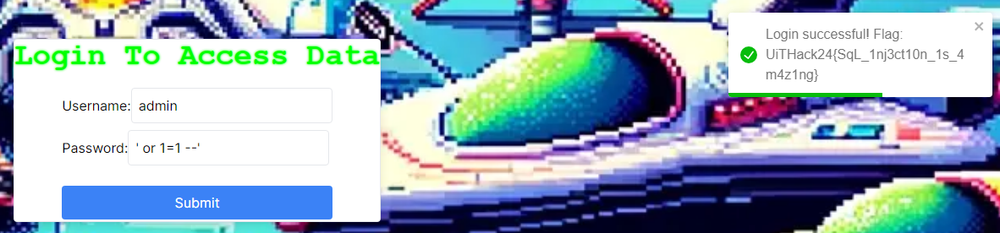

# Admin Access

You have to inflitraite the admin area of this website to get the flag. But how do you access it?

https://uithack.td.org.uit.no:3000

# Writeup

When posting it seems to go to `https://uithack.td.org.uit.no:5000/api/login`, when visiting that url and path traversing backwards I find on `https://uithack.td.org.uit.no:5000/` the text `Welcome to the SQL Injection Vulnerable Server!`. 

I quickly go back and enter `"'` into the user and password fields and get an error. After testing it seems like the single quote is the winner.

Based on that I am assuming the SQL Query lookls like this:

```sql
SELECT * FROM users WHERE username='admin' AND password='password'
```

I then tried to modify it by making the password `' OR 1=1 --` so the query will be like this:

```sql
SELECT * FROM users WHERE username='admin' AND password='' OR 1=1 --'
```

And there the flag appeared: 




```
UiTHack24{SqL_1nj3ct10n_1s_4m4z1ng}
```