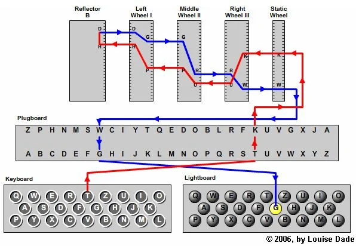

# Space Station

The Spaceship Enigma is trying to locate the Stellar Nexus Alpha space station but are having troubles due to treacherous space dust in the area. The ship is receiving strange transmission which they think may be the final piece to locate the space station.

https://uithack.td.org.uit.no:8009/get_encrypted

[⬇️ api.md](./api.md)

# Writeup

The challenge mentiones `Spaceship Enigma` which got me to think about the Enigma Machine. After quick google search I found this [Enigma Machine](https://www.scienceabc.com/innovation/the-imitation-game-how-did-the-enigma-machine-work.html) explanation which shows it perfectly clear on this image:



We do not have the plugboard or reflector but we have 3 rotors. So easily enough I made this script to test through the tree wheels:

```javascript
const decrypt = (encrypted, rotors) => {
    let result = "";
    for (let i = 0; i < encrypted.length; i++) {
        let char = encrypted[i];
        let rotor1 = rotors.rotor1[char];
        let rotor2 = rotors.rotor2[rotor1];
        let rotor3 = rotors.rotor3[rotor2];
        result += rotor3;
    }
    return result;
}
```

After a while I realised that the rotors are rotating every now and then so I need to get the newest. I made the [solve.js](./solve.js) to fetch all the data `live`. When running this I got a base64 look alike string string which I could post to the `/post_decrypt` endpoint and the flag pops out!

```
$ node solve.js 
{"response":"UiTHack24{Wow_this_flag_is_way_to_long_to_find_manually_is_it_not_?}\n"}
```