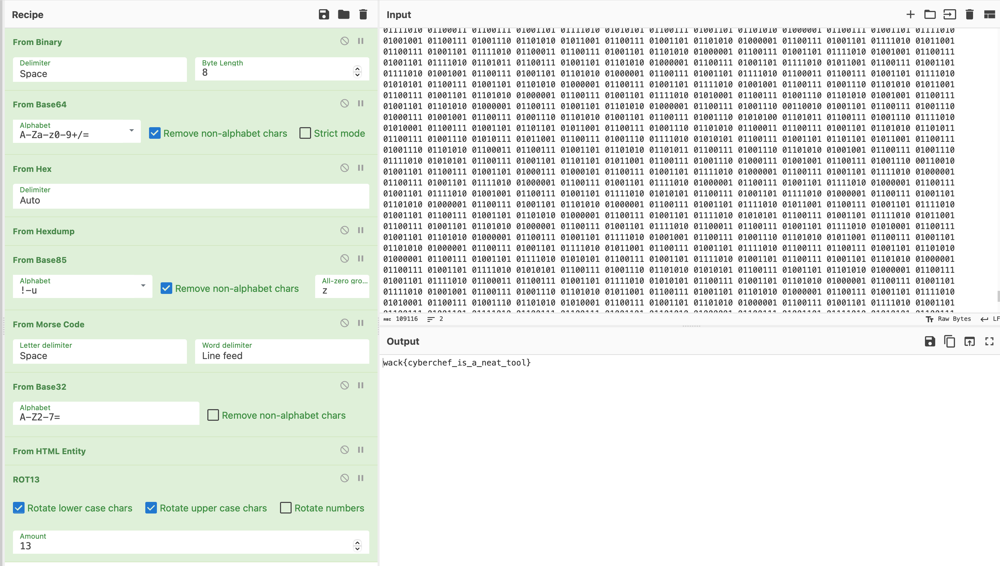

# Cyber Kitchen (easy)

If I use a sufficient number of ciphers, the flag will be secure.

Author: oksenmu

# Writeup

Tossed it into [cyberchef](https://ctfacademy.github.io/crypto/cyberchef.htm), it says "Cyber Kitchen" so guessing that is where they want it.

First took it from binary, then I saw it was base64, then hex, then hexdump. Now I got stuck and used Magic which gave me something that looked like morse in base65. 

Tossed in that and found morse manually and then I used Magic again which shows me something flagish at base32 and htmlentity. and then it looks like rotated data so I tossed in rot32 and bingo.



```
https://gchq.github.io/CyberChef/#recipe=From_Binary('Space',8)From_Base64('A-Za-z0-9%2B/%3D',true,false)From_Hex('Auto')From_Hexdump()From_Base85('!-u',true,'z')From_Morse_Code('Space','Line%20feed')From_Base32('A-Z2-7%3D',false)From_HTML_Entity()ROT13(true,true,false,13)
```

# Flag

wack{cyberchef_is_a_neat_tool}