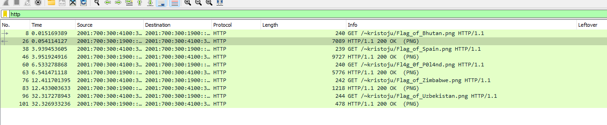
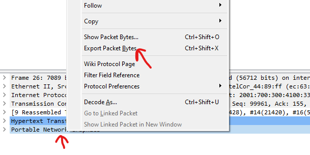

# Flagged Traffic (beginner)

I think someone is downloading flags on my network, but I couldn't find anything. Can you find something in this packet capture?

Author: Oblivion

📎 [Flagged_traffic.pcapng](Flagged_traffic.pcapng)

# Writeup

Using wireshark I quickly find HTTP traffic:



It seems to be PNG images, so exporting those by selecting one of the images and click like this:



Gives me all the flags I want. The interesting is the 1337 one:


# Flag

```
wack{7h3_gr34t_fl4g_f1nd3r}
```