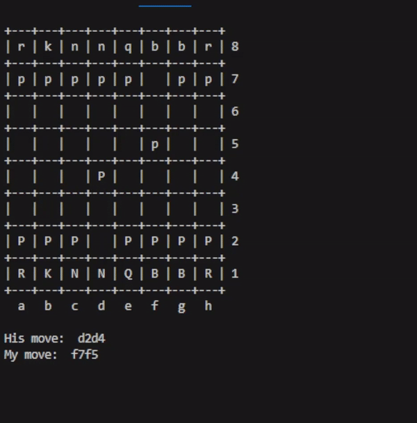

# Going Fisching (easy)

I challenge you to the greatest game of all time. I must warn you though - I am quite good and quite fast.

Author: krloer

PS: It takes a few seconds before the program start on the nc port. Be patient.

nc 46.9.42.114 9999

# Writeup

Quickly saw this was a game of Chess, and it had to be programmed to be that fast. So I started a python script to read the initial board. Then I found `stockfish` module for Python which I used to calculate the next move. Then I just sent the move to the server and waited. 

A few losses, but after tweaking the engine to be a bit too powerful I won.

```
Depth: 32
Threads: 4
Minimum Thinking Time: 30ms
Skill Level: 20
Maximum Thinking Time: 4sec
```

5 minutes (shortend down to 1 minute here) later and flag appeared.




# Flag

```
wack{1f_hum4ns_b34t_comput3rs_with_comput3rs_4r3_hum4ns_b3tt3r_th4n_comput3rs?}
```