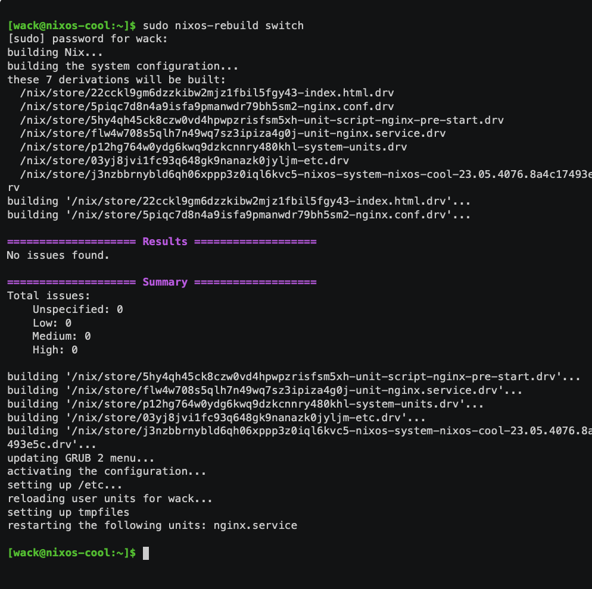
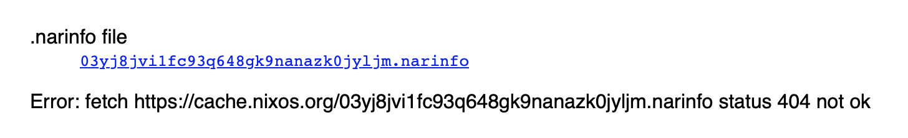

# NixOS Cool (medium)

Author: Dandellion

http://20.251.40.157/

# Writeup

This seems like a simple webpage, I did check all sources and everything I could for a flag. No dice!

They supplied the [configuration](configuration.nix) how to setup this server using NixOS. And I tried downloading NixOS as docker and virtual machine and run this as the video below shows. But this fails on all attempts. 

I tried to set the hostname for this server to what they defined in their configuration but still no flag.

In the text it says `this cool cache feature so you dont have to compile the same thing on multiple computers`. So I start Googling about the cache and NixOS and finds [this](https://nixos.wiki/wiki/Binary_Cache) which talks about `binarycache.example.com`. So I configure up this aswell.. Still no flag.

Trying to SSH into the box as the default password was `wack`. But this was changed. There is a video explaining how it is built so I guess this is imporant:



Fount [this website](https://trusted-friendly-sesame.glitch.me/) which seems to allow me to search for the hashes. So using the hash for the `etc` as it seems the flag is connected to the `etc` folder according to the configuration:
 
```
environment.etc.flag = {
  source = ./flag.txt;
};
```

Pasting the hash `03yj8jvi1fc93q648gk9nanazk0jyljm` gave no hits!



I knew there was a public cache from this now as this shows:

```
services.nix-serve = {
  enable = true;
  openFirewall = true;
};
```

According to the [docs](https://github.com/edolstra/nix-serve) it opens a port 5000 which I test and get a hit on! From the `Nix Cache Viewer` I was on earlier I learned the url is:

```
https://cache.nixos.org/03yj8jvi1fc93q648gk9nanazk0jyljm.narinfo
```

So adding `http://20.251.40.157:5000/` gave me hit. and if I remember correctly it shows me some details and from there I can get deeper down and find the actuall contents of the package.

Ending up finding `http://20.251.40.157:5000/nar/03yj8jvi1fc93q648gk9nanazk0jyljm.nar` which actually had a flag in it when I used strings on it.

# Flag 

```
Dont remember the flag I inserted
```