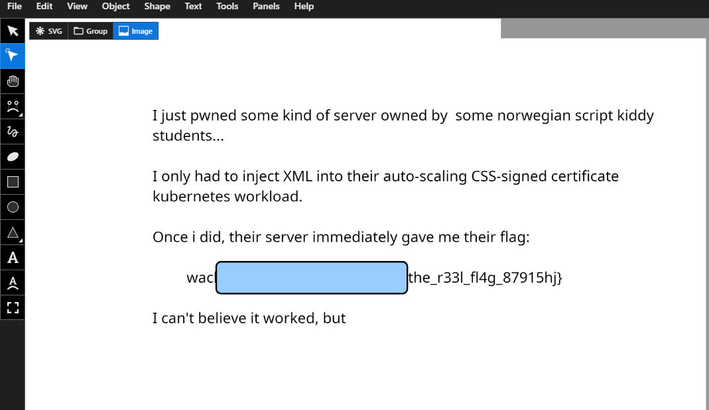
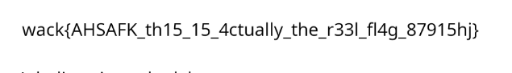

# Stegosaurus (easy)

Rawr XD, here is your flag

Author: taschmex

📎 [Stegosaurus.jpg](Stegosaurus.jpg)

# Writeup

I quickly load it in [aperisolve](https://www.aperisolve.com/1fe2eb40a96910fdfcb93ff8e22f8a32). It seems to be a lot of data in the `binwalk` portion.

Downloading that and copying the data of the SVG file into [boxy-svg](https://boxy-svg.com/app)



Then deleting the box to reveal the flag:



# Flag

```
wack{AHSAFK_th15_15_4ctually_the_r33l_fl4g_87915hj}
```