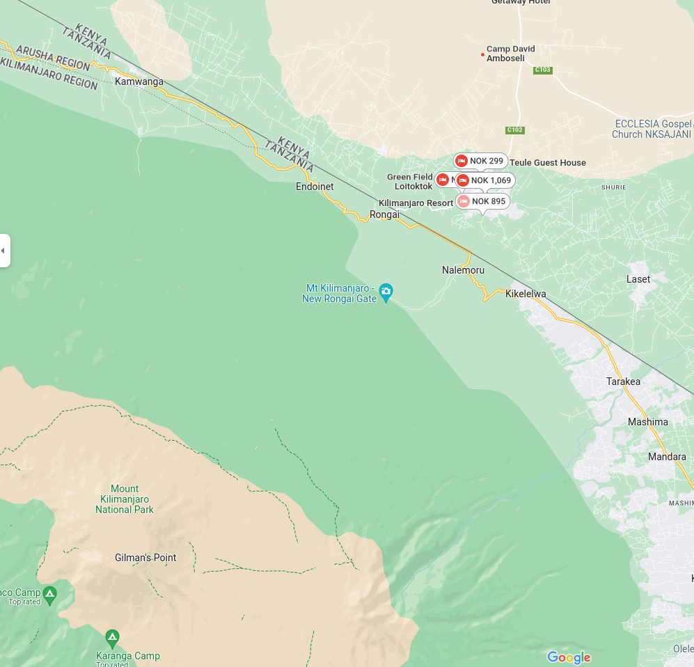

# Afrikatur 2 (hard)

Etter å ha sett på sånne rare kattedyr trengte jeg å slappe av litt, og hva kan slå en god utsikt. Hvilket hotell er jeg på her?

Flag format: wack{hotellnavn}. Erstatt eventuelle mellomrom med "_"

Author: Oblivion

📎 [pool.jpg](pool.jpg)

# Writeup

Quick image reverse search gave me nothing, seeing the mountain is Kilmanjaro I tried to find hotels around there. 

Took a bit of research and some wild testing with "look alike" pools. But no hits. 

I found this viewpoint place and googled for images from there. 



The mountain shape looks identical. But on the pool image it looks like we're a bit to the "right" of the mountain. So i tried `Elerai Camp` which looked promising with the images of the pool but the vent in the pool was not the same place and it was some changes. But the images can be older. I tried it, no dice!


Seeing that it seem the mountain is a bit more to the right on the pool than this I found a new one!


This might actually be more close, looking at the images.. Bingo!! The pool! Looks identical, trying this one and yeah flag secured!

# Flag

```
wack{Amboseli_Serena_Safari_Lodge}
```