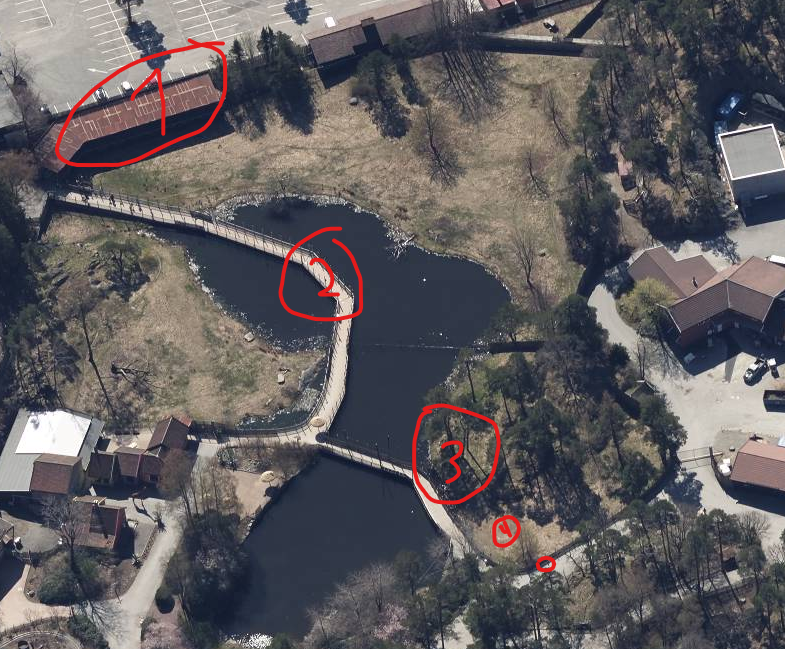

# Afrikatur (medium)

Jeg var på Afrikatur i 2016, og tok en del bilder. Kan du finne ut hvor jeg var?

Finn koordinatene til der bildet er tatt fra, med 3 desimaler. For eksempel: 69.911, 42.420

Flag format: wack{lat, long}

Author: Oblivion

# Writeup

I instantly recognize this place as `Dyreparken` in the city `Kristiansand`. I've personally been working on the railings on the seating areas in the background. 

It is where the Cheeta's are, and I tried a few locations quicly from Google but failed. After looking a bit closer getting my girlfriend to point out a few mistakes Ive made and there it is.

1. Is the seating area
2. Is the walk area
3. Is the treelines behind the cheeta 
4. Is where the photographer stands



Getting the coordinates was quickly and simple. And there it was!

# Flag

```
wack{58.182, 8.143}
```