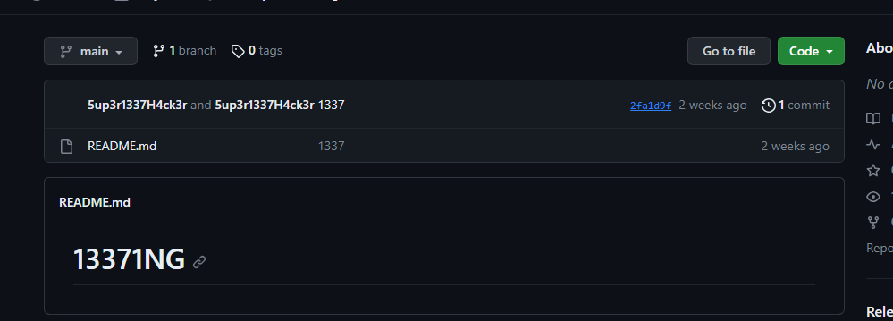
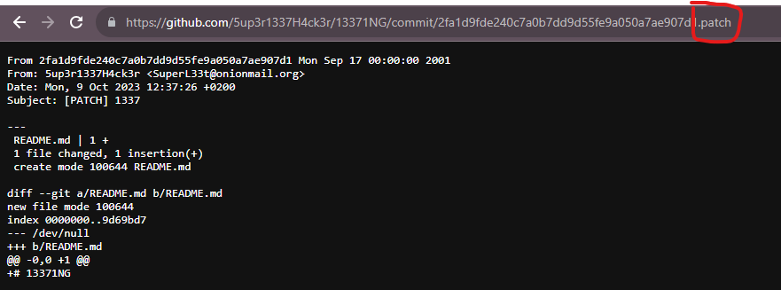

# First Contact (beginner)

I really like this niche programmer on Github, and want to get into contact with them. Their handle is @5up3r1337H4ck3r, but I cannot find any contact information anywhere. Can you help me find their email?

Flag format: wack{email}

Author: Oblivion

# Writeup

Checking the user on Github I find one repo with a few commits. Commits reuqires a mail address so guessing this is where it would be found.



Opening the commit shows nothing, but to see the raw commit add `.patch` on the end of the url:



# Flag:

```
wack{SuperL33t@onionmail.org}
```
