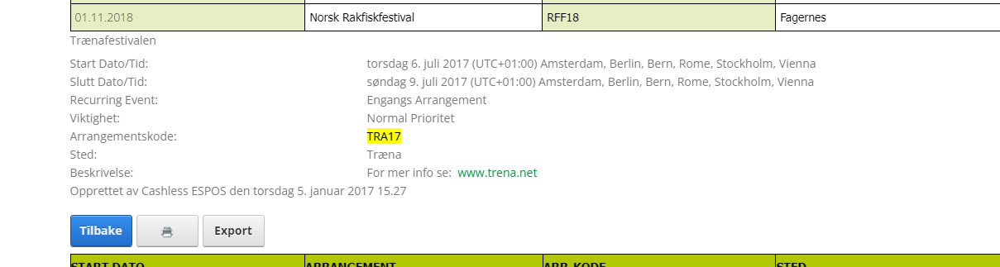
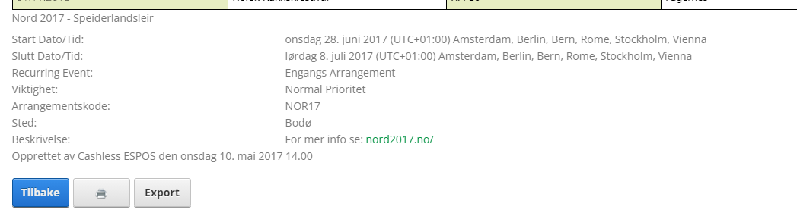
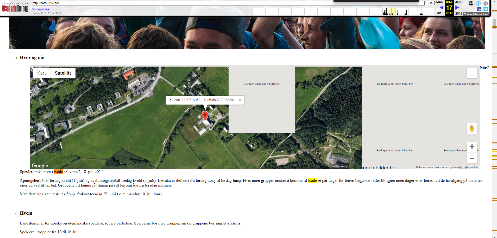
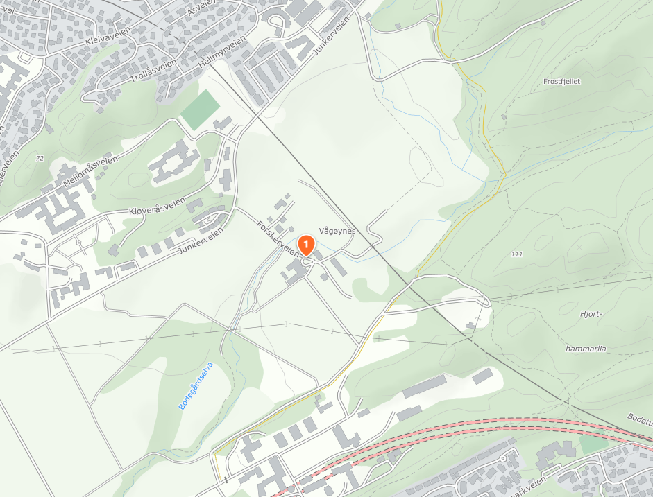
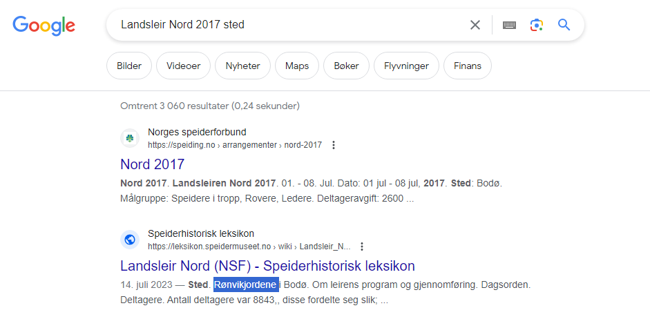

# Kvittering (easy)

Jeg har dette bildet av en kvittering, det var sikkert viktig en gang, men jeg husker ikke hvor jeg var da jeg tok det. Kan du finne ut hvor jeg var?

Finn stedsnavnet til der bildet er tatt. For eksempel: Lerkendal

Flag format: wack{stedsnavn} Erstatt eventuelle mellomrom med "_"

Author: Oblivion

📎 [kvittering.jpg](kvittering.jpg)

# Writeup


Seeing `Cashless` I find their [website](https://www.cashless.no/). They have an event overview and the date on the receipt shows:  `07.07.2017` and on that date there were 1 festival going on `Tærnafestivalen`.



So trying a whole lot of flags around that. Stuck and annoyed I get a tip to look at the top of the receipt. And then I get it, the top shows the actual event holder. And on the Cashless site there is an event that ends the next day from which also uses Cashless.



Their website was nord2017.no which was down so I just used way back machine. Found the location and some information:



But a place for the area which was supposed to be the flag. I tried a lot but all failed.



Neither any locations near this works.. Then a Google search shows me a some more information:



Bingo! Rønvikjordene!

# Flag

```
wack{Rønvikjordene}
```