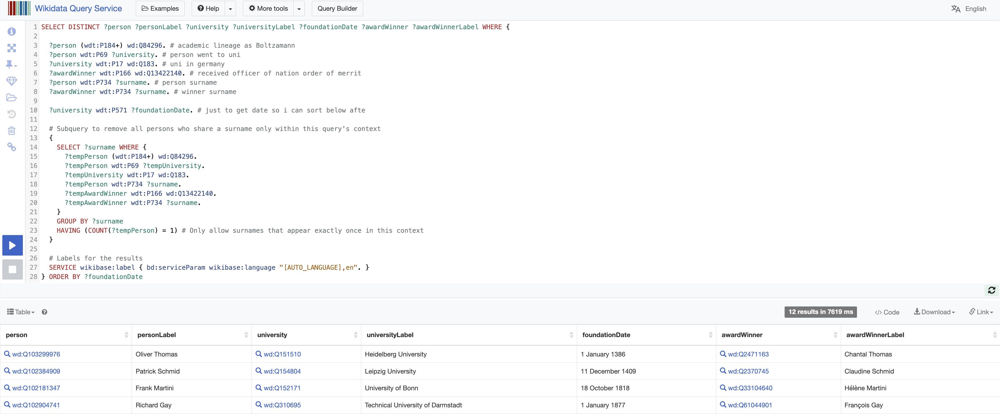

# SPARQLing Connections

There's an individual who shares academic lineage with Boltzmann. They also share surnames with someone who won a civillian merit award in France, I think it was an officer? They went to a university in germany.

In this group, they alone have their surname.

Out of the people this description fits, the person I am looking for went to the oldest university in the group.

Answer with wack{Name of Person} (including spaces/dashes)

e.g wack{Onde Mand}

# Writeup

This was pretty hard, I personally gave up but someone the team found [Wikidata](https://query.wikidata.org/) and crafted a query for it after I asked about `SPARQL`. That put a fire in my belly, together with the team we discussed and crafter queries for this fancy search engine.

Not understanding a whole bunch, we tweaked until we got something reasonable. A few fault here and there (total 10 guesses) and we got the flag.

```sql
SELECT DISTINCT ?person ?personLabel ?university ?universityLabel ?foundationDate ?awardWinner ?awardWinnerLabel WHERE {

  ?person (wdt:P184+) wd:Q84296. # academic lineage as Boltzamann
  ?person wdt:P69 ?university. # person went to uni
  ?university wdt:P17 wd:Q183. # uni in germany
  ?awardWinner wdt:P166 wd:Q13422140. # received officer of nation order of merrit
  ?person wdt:P734 ?surname. # person surname 
  ?awardWinner wdt:P734 ?surname. # winner surname 

  ?university wdt:P571 ?foundationDate. # just to get date so i can sort below afte
  
  # Subquery to remove all persons who share a surname only within this query's context
  {
    SELECT ?surname WHERE {
      ?tempPerson (wdt:P184+) wd:Q84296.
      ?tempPerson wdt:P69 ?tempUniversity.
      ?tempUniversity wdt:P17 wd:Q183.
      ?tempPerson wdt:P734 ?surname.
      ?tempAwardWinner wdt:P166 wd:Q13422140.
      ?tempAwardWinner wdt:P734 ?surname.
    }
    GROUP BY ?surname
    HAVING (COUNT(?tempPerson) = 1) # Only allow surnames that appear exactly once in this context
  }
  
  # Labels for the results
  SERVICE wikibase:label { bd:serviceParam wikibase:language "[AUTO_LANGUAGE],en". }
}
```



The flag was `wack{Oliver Thomas}`