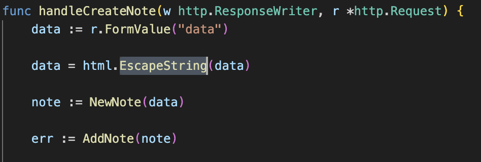

# GoGoGo! (revenge)

The last challenge was too easy for you! Now, only the admin can see the flag.

http://ctf.wackattack.eu:5028

[⬇️ gogogo_revenge_handout.zip](./gogogo_revenge_handout.zip)

# Writeup

This challenge is similar to the last one, but now the flag is only shown if you're local. The code is the same as the last challenge, but now we need to find a way to bypass the IP check. 

You can create notes, report them to admin and not much more. There are some templating done on the note before storing in DB but it is hard to use due to the HTML escaping.

The task hints towards XSS and `bot.ts` is a file using puppeteer to visit a reported note. 

So the solution seems to be inject XSS, make it load the `/admin/flag` page and report the note to me via e.g. [Webhook Site](https://webhook.site/).

But, `w.Header().Set("Content-Security-Policy", "default-src 'self';")` this line in `challenge.go` is blocking the XSS from working. It will not execute any script from a different domain or `<script>` tags. And the note is HTMLEscaped so you can't inject any tags.



We also found out that the note is going through a Templating parser `template.New("note").Parse(note.Data` in challenge.go after escaping. We could for a very long time not find a fault in this as it would fail due to the HTML escaping. But suddenly we found a way to bypass it.

Since we are able to inject templating we injected a printf statement and the data as hex to bypass it. 

```go
{{printf `%c%c%c%c%c%c%c%c` 0x49 0x6e 0x6a 0x65 0x63 0x74 0x65 0x64}}
```

This gave `Injected` as a note, and this is after the html escaping. So we could craft a Javascript payload and a HTML payload which loaded the javascript payload.

Basically the HTML payload contains an iframe loading `/admin/flag` and script tag to load my other note with javascript.

The javascript fetches the conteint in the iframe (the flag) and creates a link on the website to my webserver with the flag in the URL. Then it clicks the link so the `admin` leaks the flag to my server.

We crafted [solve.py](./solve.py) with to automate the process so we only had to send the HTML UUID to the admin and a few seconds later my webhook.site sends me a notification!

