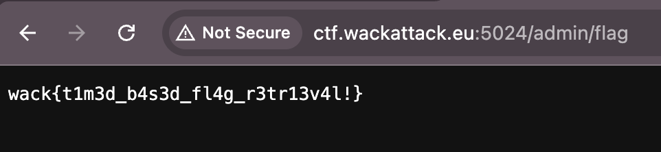

# GoGoGo!

I made a simple note taking service. No HTML!

http://ctf.wackattack.eu:5024

[⬇️ gogogo_handout.zip](./gogogo_handout.zip)

# Writeup

This one was supposed to show XSS but seems to be broken, inside `challenge.go` there is a few lines of code that is interesting:

```go

// This endpoints seem to show the flag
mux.HandleFunc("GET /admin/flag", handleAdminGetFlag)

// This function handles the request and as you see it just returns the flag either if you're local or else..
func handleAdminGetFlag(w http.ResponseWriter, r *http.Request) {
	remoteAddr := r.RemoteAddr
	ip, _, err := net.SplitHostPort(remoteAddr)
	if err != nil {
		http.Error(w, "Invalid remote address", http.StatusInternalServerError)
		return
	}
	if ip == "127.0.0.1" || ip == "::1" {
		w.Write([]byte(FLAG))
	} else {
		w.Write([]byte(FLAG)) // This should be something else!
	}
}
```

Visiting `/admin/flag` reveals the flag.

