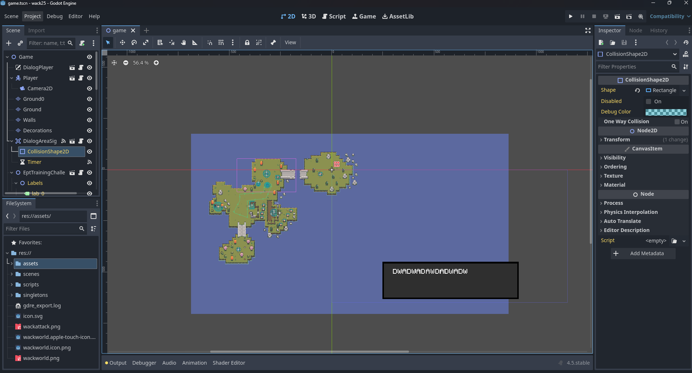
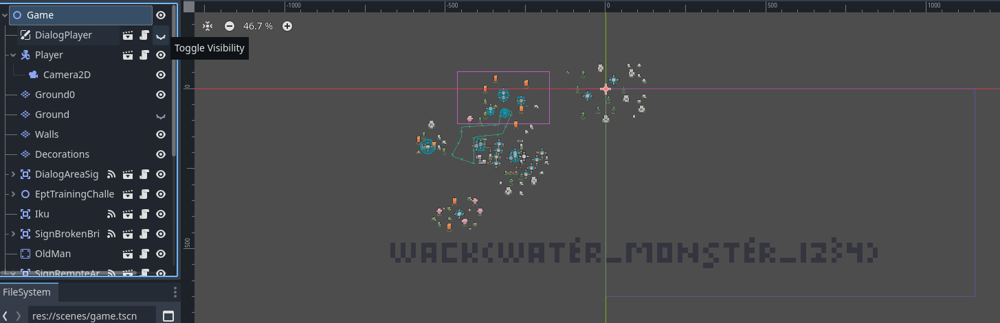

# Remote island

Welcome to wackworld! There are three flags hidden in this game. Are you able to find them all?

[🔗 https://dvncc5c8gx09s.cloudfront.net](https://dvncc5c8gx09s.cloudfront.net)

# Writeup

With Godot RE Tool I was able to open the whole project in GoDot



Hiding a few layers (water and the dialog) then I got the flag:



# Flag

```
wack{water_monster_1234}
```