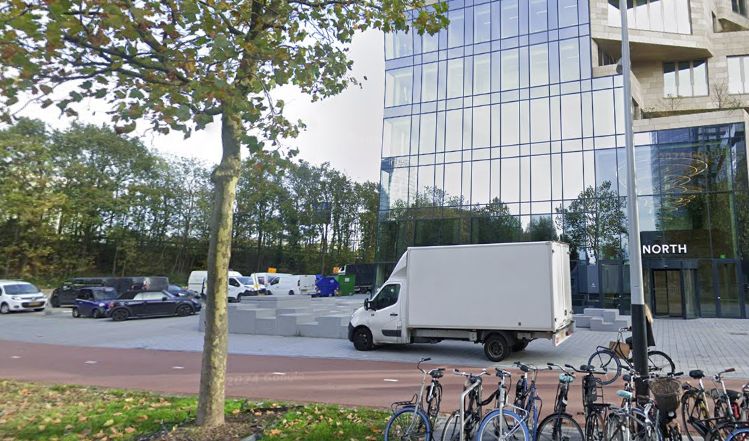

# Curious Steps

On a trip I noticed these curiously placed steps. Can you find out where I am standing in this photo? I think I remember there being a pretty cool building right next to them.

Please provide the coordinates of where I am standing in the format `latitude,longitude` with a precision of 4 decimal places.

Flag format: `wack{latitude,longitude}` e.g. `wack{59.3293,18.0686}`

[⬇️ steps.png](./steps.png)

# Writeup

Seeing "Moleni&C" and it looks like a big city, therefor i found all locations and started with the biggest cities.. A match was found in amsterdam:

https://maps.app.goo.gl/p7ADDcbQFxLtX1oX7



# Flag

```
wack{52.3380,4.8769}
```