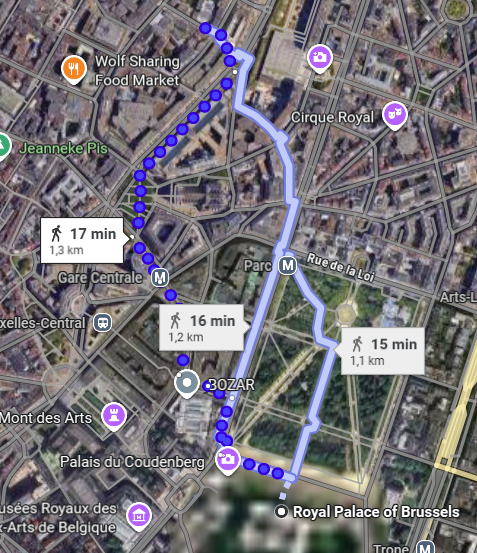

# Find Me

While I was on a roughly 20 minute walk from the Comics Art Museum to a little castle nearby someone snapped a photo of me. I remember wearing this backpack. Can you find out where I was?

Flag format: `wack{Street Name}`

[⬇️ bag.png](./bag.png)

# Writeup

Here AI had to explain, the only thing I found was a Comics Art Museum in Brussels to Petit-Château which is about 20 minutes. Crawling that route 



This wa https://maps.app.goo.gl/n5iMRqoXXzZub9Xt9

Tried: Leuvenseplein

# Flag

```
flag{goes_here}
```