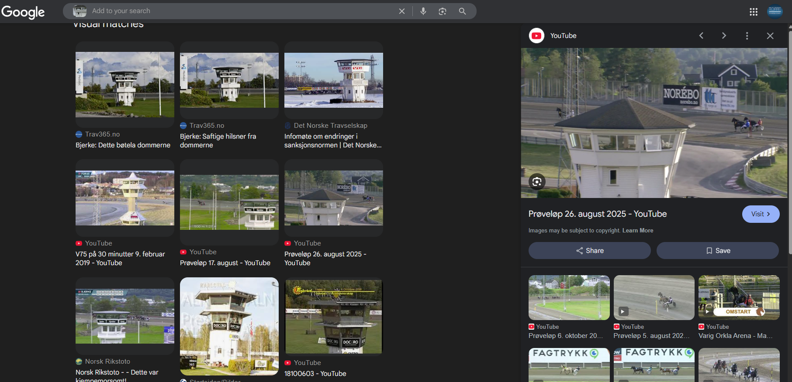
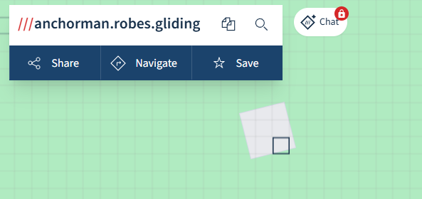
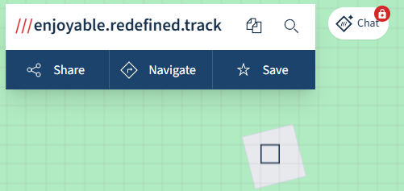

# White Tower

I took this photo of this white tower a little bit ago. What three words best describe the center of this tower?

Flag format: `wack{word.word.word}`

[⬇️ tower.png](./tower.png)

# Writeup

Quickly cut the house into google reverse



That youtube clip is from Momarken. What3Words.com is perfect to describe the 3 words, i pasted in the coords to the dead center of the tower and got this:



Sadly enough I belive the best 3 words would be the middle of that figure on the what3words map:



But I tried that first and it was not added as an alternative.

# Flag

```
wack{anchorman.robes.gliding}
```